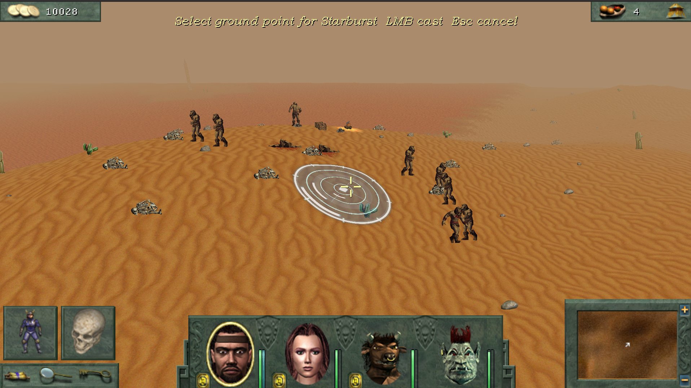
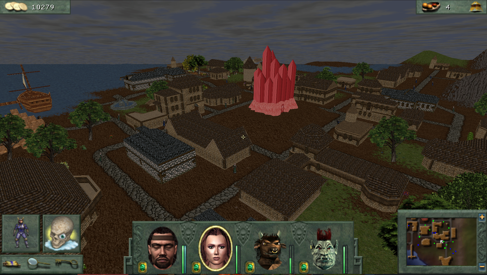
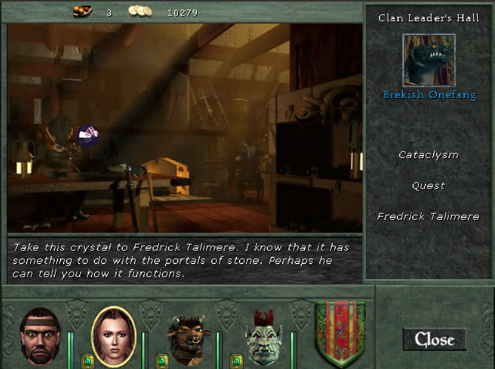
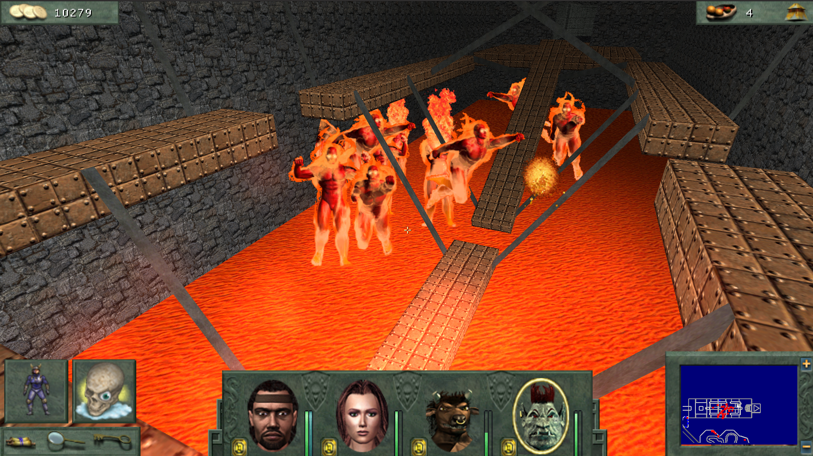
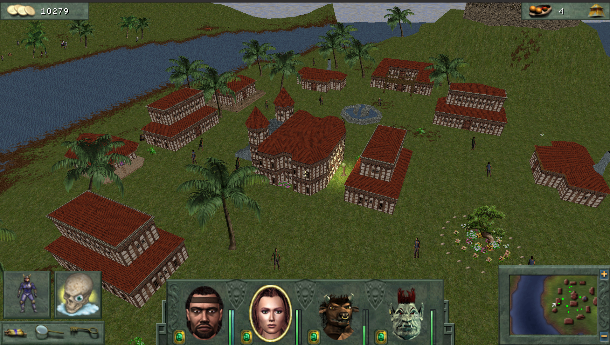
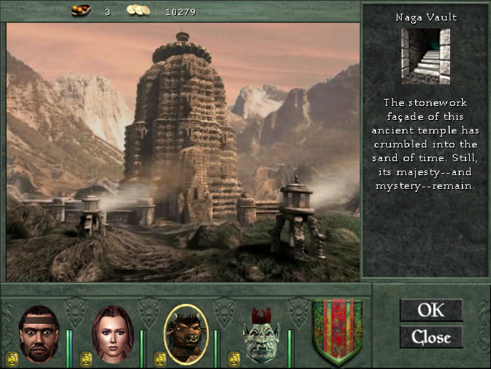
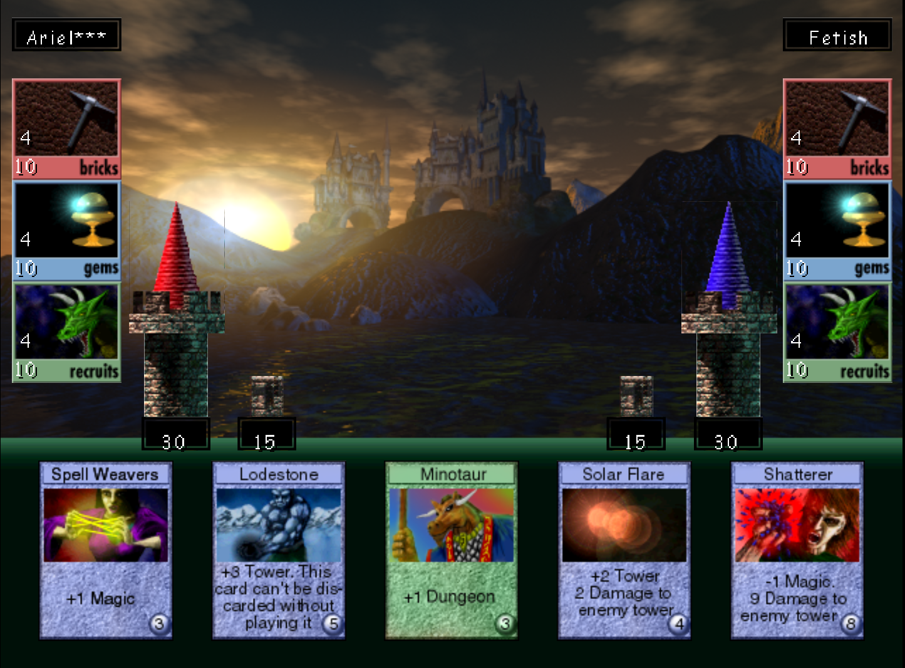
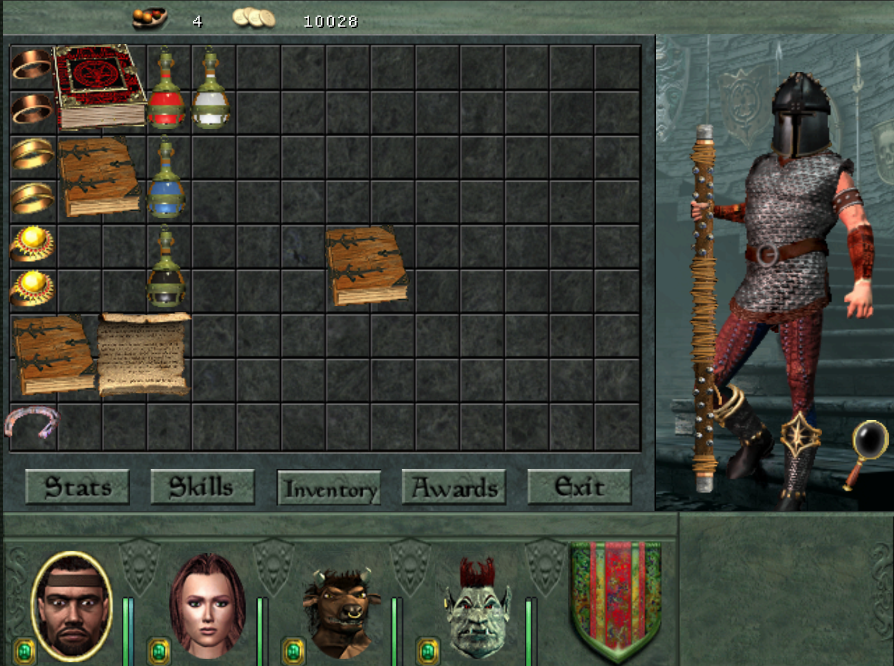
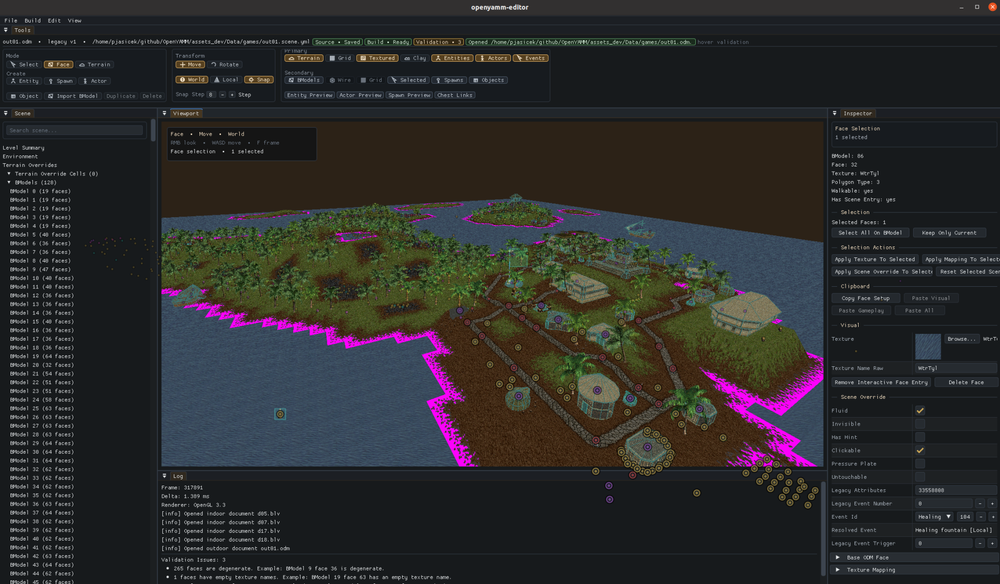
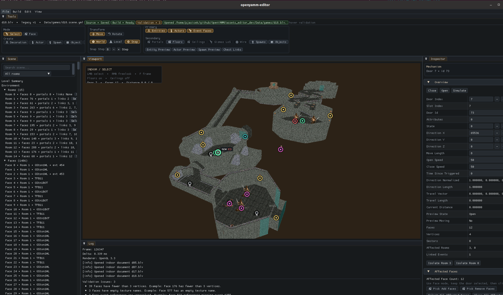

# OpenYAMM

OpenYAMM is a modern C++ reimplementation of the Might and Magic VIII game engine.

The goal is to keep the original game data and gameplay feel while providing a clean,
maintainable, cross-platform engine with modern rendering, audio, UI, save/load, tooling,
and editor support.

## Status

OpenYAMM is in active development. It currently includes:

- outdoor and indoor gameplay runtime work
- map loading and rendering
- party, inventory, combat, spells, projectiles, shops, houses, chests, dialogue, quests, and save/load systems
- SDL3 audio with music, sound effects, and video playback
- bgfx rendering
- data-driven gameplay tables and UI layouts
- regression tests and headless diagnostics
- an editor target for map and content workflows

Expect missing features, bugs, and ongoing data compatibility work.

## Features

- C++20 codebase
- SDL3 platform, input, and audio layer
- bgfx renderer
- PhysicsFS asset filesystem
- FFmpeg-backed video playback
- Lua-powered event scripts
- tab-separated gameplay tables
- YAML scene and UI layout data
- unit and regression test coverage for gameplay systems

## Assets

OpenYAMM requires game assets from a legally owned copy of Might and Magic VIII.

Development assets are loaded from:

```text
assets_dev/
```

The default development layout is:

```text
assets_dev/
  Anims/
  Data/
  Music/
```

Runtime packages can be distributed as ZIP archives under:

```text
assets/
```

The engine keeps practical original asset formats such as TXT gameplay tables, BMP-style
art assets, WAV sound effects, MP3/FLAC music, and OGV video. Legacy archive and video
container formats are replaced for runtime use.

## Building

Requirements:

- CMake 3.24 or newer
- C++20 compiler
- Lua 5.3 or 5.4 development package
- standard native build tools for your platform

Configure and build:

```sh
cmake -S . -B build
cmake --build build --target openyamm -j25
```

Run:

```sh
./build/game/openyamm
```

Build tests:

```sh
cmake --build build --target openyamm_unit_tests -j25
./build/tests/openyamm_unit_tests
```

Build the editor:

```sh
cmake -S . -B build -DOPENYAMM_BUILD_EDITOR=ON
cmake --build build --target openyamm-editor -j25
```

Run the editor:

```sh
./build/editor/openyamm-editor
```

## Useful CMake Options

```text
OPENYAMM_BUILD_EDITOR=ON      Build the editor target
OPENYAMM_BUILD_TOOLS=ON       Build asset and data tooling
OPENYAMM_BUILD_TESTS=ON       Build unit tests
OPENYAMM_DEV_ASSETS_DIR=...   Override the development asset directory
OPENYAMM_USE_SYSTEM_SDL3=ON   Use an installed SDL3 package
```

## Repository Layout

```text
engine/              shared runtime systems
game/                game application and gameplay systems
editor/              editor application
tools/               asset and data tools
tests/               unit and regression tests
assets_dev/          development asset root
assets_editor_dev/   editor development asset root
res/                 README screenshots
```

## License

No license has been declared yet.

## Screenshots










## Editor Screenshots



